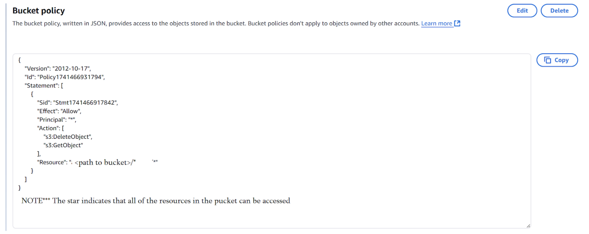
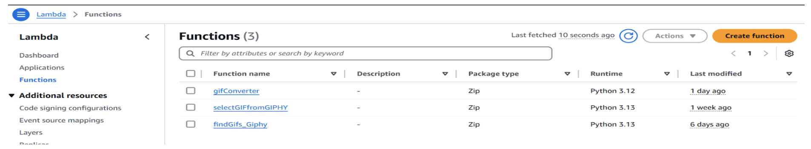
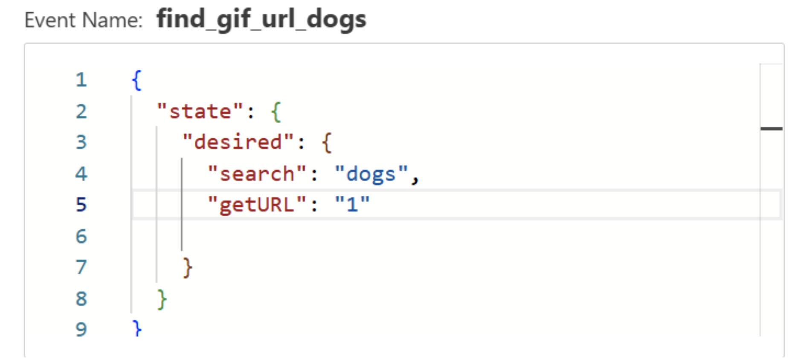
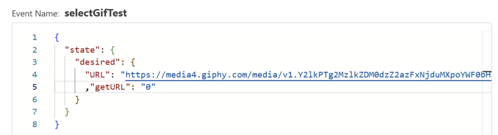
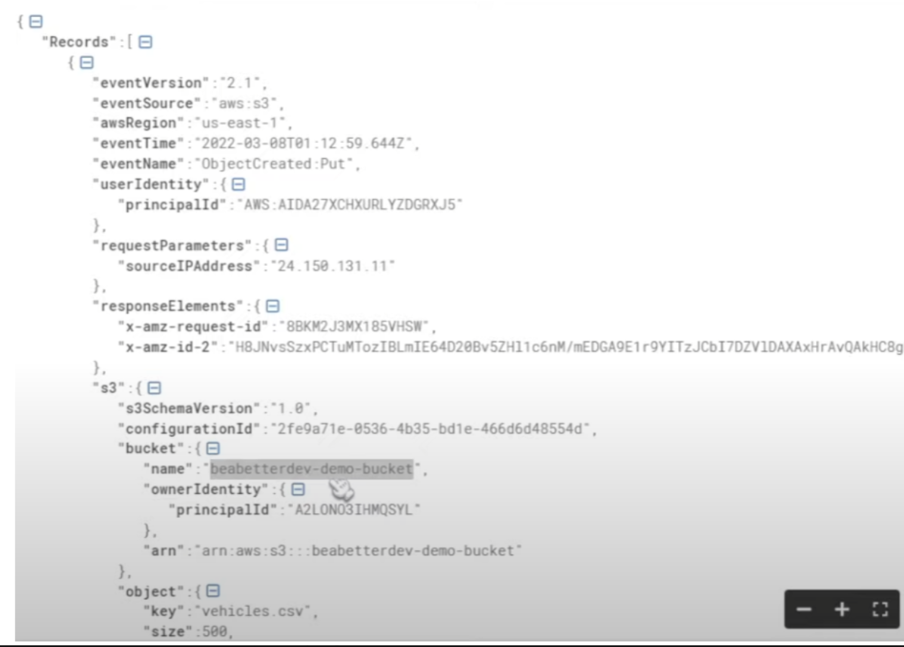

# 🛠 Implementation

## **TV Remote and IR Sensor**
The TV remote was programmed with a **specific TV code** so that each button could be uniquely identified. By using the **Saleae Digital Logic Analyzer**, we captured and analyzed the waveforms of button presses, converting them into hexadecimal format for recognition by the **CC3200 board**.

The **IR sensor** was built based on the manufacturer’s circuit diagram. The output was connected to a **GPIO pin on the CC3200**, where a **GPIO interrupt handler** was used to detect signals. These signals were processed using a **SysTick timer**, allowing us to determine whether the trigger represented a **zero, one, or clear signal**. The CC3200 handled all button recognition internally.

---

## **AWS Integration**
AWS served as the **backbone** of our prototype, handling **GIF storage and processing**. We leveraged **AWS IoT Core, S3 Buckets, and Lambda Functions** to manage data flow between the **GIPHY API** and the **CC3200**.

### **IoT Core**
IoT Core was used to detect user actions, such as **search queries and GIF selection**. A **device shadow** was created, and **SQL-based message routing rules** were established to trigger different events. The **getURL** variable distinguished actions:
- `getURL = 1` → Trigger **Lambda function** to retrieve GIF URLs.
- `getURL = 0` → Retrieve **selected GIF** from the storage bucket.

### **S3 Buckets**
S3 Buckets stored all essential data, including **GIF URLs and processed RGB565 frames**. The **bucket permissions** were modified to **allow public access**, enabling direct **HTTP GET requests** from the **CC3200 board**.

#### **Example S3 Bucket Policy**

To enable public access, we had to:
1. **Disable public access restrictions**.
2. **Set bucket ownership to "Bucket Owner Preferred"**.
3. **Apply a policy to permit object access**.

### **Lambda Functions**
Lambda functions were used to **trigger automated processes** and **handle data transformation**.

#### **Lambda Functions Used**

Each function played a specific role:

1️⃣ **findGifs_Giphy**  
- Triggered when a **search query** was submitted (`getURL = 1`).
- Called the **GIPHY API** and retrieved GIF URLs.
- Stored retrieved URLs in an **S3 Bucket**.

##### **Example Input for findGifs_Giphy**

2️⃣ **selectGIFfromGIPHY**  
- Triggered when a user **selected a GIF** (`getURL = 0`).
- Downloaded the selected GIF and stored it in **S3**.

##### **Example Input for selectGIFfromGIPHY**

3️⃣ **gifConverter**  
- Processed the **selected GIF**, converting each frame to **RGB565** format.
- Stored frames in a **new S3 bucket** for retrieval by the CC3200.

##### **Example JSON Data Passed to Lambda**

---

## **TI CC3200 Board**
The CC3200 handled **HTTP requests, user interface logic, and display rendering**.

### **HTTP Request Handling**
- **Secure sockets** were used for **IoT Core requests**.
- **HTTP Client Library** was used for **S3 bucket interactions**.
- GET requests retrieved **RGB565 image frames** for display.

### **Menu System**
The **menu system** was structured with three main states:
- **MENU:** User enters a search query.
- **SEND:** Query is sent to AWS.
- **DISPLAY:** User selects a GIF for playback.

A **one-hot state machine** was used to manage state transitions, ensuring smooth **menu navigation and animation playback**.

### **Accelerometer & OLED Display**
- The **accelerometer** continuously monitored **device orientation**, adjusting the display as needed.
- **GIF frames** were fetched from **S3 storage** and rendered **pixel-by-pixel** in **RGB565 format**.

To **optimize performance**, we:
- **Limited GIF frames to 20** to reduce memory load.
- Used **HTTP requests** to **pre-fetch GIF sizes**.

---

## 🔙 Return to Main Page  
[🔙 Return to Home](index.md)
