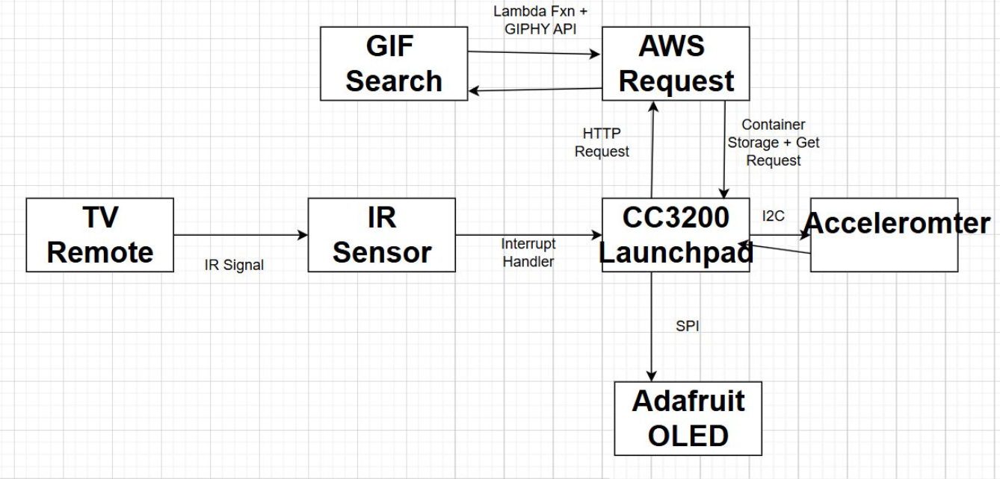
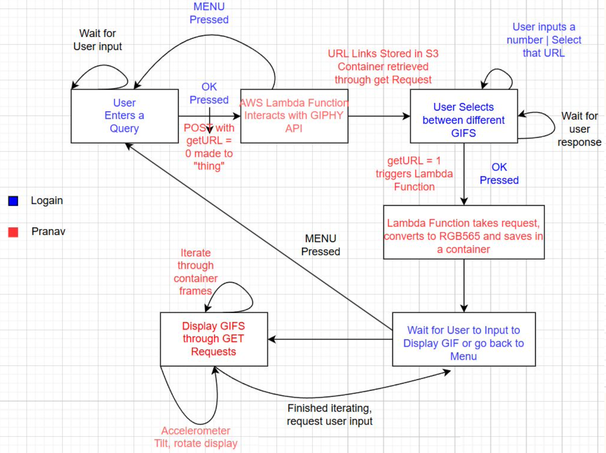

# 🎥 GIF Display Project  
*Developed for EEC 172 - Embedded System Design, Winter 2025*  
📍 **University of California, Davis**  
👨‍🏫 **Professor:** Soheil Ghiasi  
🛠 **TA:** Randall Fowler  

👨‍💻 **Team Members:**  
- Logain Abdelhafiz  
- Pranav Rawat  

---

## **📌 Introduction**  
This project presents the design, implementation, and evaluation of a **GIF Displayer**, developed as part of the EEC 172 coursework.  

The system integrates:
- **Adafruit OLED Display**
- **CC3200 LaunchPad**
- **AWS Lambda + Giphy API**

📡 **User Interaction:** A **TV remote and IR sensor** enable navigation, allowing users to **search, select, and display GIFs**.  
📱 **Screen Rotation:** An **accelerometer** dynamically **adjusts display orientation** for an optimized user experience.  

By leveraging **real-time GIF retrieval and embedded system processing**, this project offers a **unique and efficient solution** for GIF display in constrained environments.  

---

## **🏗 System Overview**  
The **workflow** starts when a user enters a **search query** using the TV remote.  
🔹 The **CC3200 LaunchPad** sends this query to the **Giphy API**  
🔹 AWS Lambda retrieves **relevant GIFs** and stores their **URLs** in **S3 Storage**  
🔹 The user **selects a GIF** from the menu, and the **CC3200 fetches & displays it**  

⚡ **Performance Enhancements:**  
- **Direct Memory Access (DMA)** optimizes rendering, reducing latency.  
- The **Accelerometer** **detects device orientation** for a **better viewing experience**.  

---

## **🖥 System Architecture Diagram**
This **diagram** shows how each component **interacts** within the system:

### **Key Components:**
1️⃣ **TV Remote & IR Sensor** – Captures user input and sends **signals** to the **CC3200 LaunchPad**.  
2️⃣ **CC3200 LaunchPad** – The central unit that **processes requests, fetches GIFs, and controls display rendering**.  
3️⃣ **AWS Lambda + Giphy API** – Fetches GIFs and **stores them in S3 for retrieval**.  
4️⃣ **Adafruit OLED Display** – Displays **GIF animations**.  
5️⃣ **Accelerometer** – Adjusts **screen rotation dynamically** based on device movement.  

---

## **🔄 State Machine & Workflow Diagram**
This **workflow diagram** outlines the step-by-step **GIF retrieval and display process**:

### **How It Works:**
✅ **User Enters Query** – Uses the **remote** to enter a **search term**.  
✅ **AWS Lambda & Giphy API** – Retrieves **GIFs** based on the query.  
✅ **User Selects GIF** – The user **chooses** a GIF from the **menu**.  
✅ **GIF Processing** – The GIF is **converted to RGB565** for **OLED display**.  
✅ **GIF Display & Rotation** – Frames are **displayed & adjusted** dynamically using **accelerometer input**.  

🔹 **Optimized Rendering:** Uses **DMA-based frame loading** to **minimize latency**.  

---

## **🛠 Implementation & Challenges**
The system's **main challenges** revolved around **GIF retrieval, processing efficiency, and display performance**:

| **Challenge** | **Solution Implemented** |
|--------------|----------------------|
| **Efficient GIF Processing** | AWS Lambda handles **GIF conversion & retrieval** |
| **Latency in GIF Rendering** | **DMA-based rendering** accelerates frame loading |
| **Remote Responsiveness** | **Interrupt-driven IR signal processing** improves UI responsiveness |
| **Screen Rotation Stability** | **Motion filtering algorithms** prevent erratic rotations |

---

## **🔮 Future Enhancements**
To **improve the project**, the following features could be **integrated**:  

🚀 **Voice Command Support** – Hands-free GIF selection.  
🎨 **UI Enhancements** – Categorized GIF browsing for **easier navigation**.  
📊 **Optimized Animation Handling** – Further improving GIF playback **smoothness**.  

---

## **🧾 Bill of Materials**
This project **reuses hardware from previous labs**:  

| **Component** | **Quantity** | **Source** |
|--------------|------------|-----------|
| CC3200 LaunchPad | 1 | Lab Kit |
| Adafruit OLED Display | 1 | Lab Kit |
| IR Sensor | 1 | Lab Kit |
| TV Remote | 1 | Lab Kit |
| AWS Services | N/A | AWS Account |
| Accelerometer | 1 | Lab Kit |

---

## **📢 Conclusion**
🎯 **The GIF Displayer Project successfully demonstrates:**  
✔️ **Real-time GIF retrieval**  
✔️ **Cloud-based processing**  
✔️ **Embedded display rendering**  

By combining **hardware-software interaction, cloud-based data management, and real-time processing**, this system **efficiently brings GIF animations to embedded devices**.  

📝 **This report serves as a reference for understanding the system’s design, implementation, and potential future improvements.**  

### **👨‍💻 Developed by:**
- **Logain Abdelhafiz**
- **Pranav Rawat**

---
